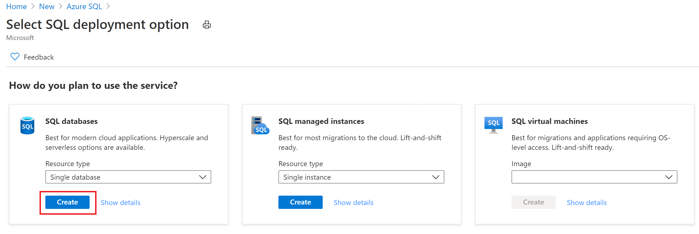

# Azure Data Factory et procedure stockée (Azure SQL Database)

Lors d'un projet avec un client, une étape consistait à transformer des fichiers, déposés dans un stockage blob, à l'aide d'une procédure stockée existante, puis de déplacer le résultat dans un stockage "Azure Files".

Cet article a pour but de partager les différentes étapes pour réaliser ce pipeline de transformation et ainsi que les différentes astuces utilisées pour mener à bien cette partie du projet

## Pré requis

- [Un abonnement Azure](https://azure.microsoft.com/fr-fr/free/)
- [Azure Storage Explorer](https://azure.microsoft.com/en-us/features/storage-explorer/) 

# Création des services Azure
## Création d'un groupe de ressources
Nous allons commencer par créer un groupe de ressouces afin d'héberger les différents services de notre solution de transcription de fichiers audio.

Depuis le portail [Azure](https://portal.azure.com), cliquez sur "**Create a resource**"

 Puis, recherchez "**Resource group**"

 

Cliquez sur le bouton "**Create**"

Dans le champ "**Resource group**", donnez un nom à votre groupe de ressources. Cliquez sur le bouton "**Review + Create**"

Dans l'écran de validation, cliquez sur le bouton "**Create**"

Revenez à l'accueil du portail Azure. Cliquez sur le menu burger en haut à gauche puis sur "**Resource** **groups**"

Cliquez sur le groupe de ressources créé précédement

## Création du compte de stockage

Une fois dans le groupe de ressources, cliquez sur le bouton "**Add**"

Recherchez le compte de stockage

Cliquez sur le bouton "**Create**"

Complétez la création du compte de stockage et cliquez sur "**Review** + **create**"

Après avoir vérifié les informations de création du compte de stockage, cliquez sur le bouton "**Create**"

## Création d'une base de données Azure SQL
Ici, nous allons créer une base de données uniquement pour héberger et exécuter notre procédure stockée. Vous pouvez donc, si vous le souhiatez, utiliser une base de données Azure éxistante.

Retournez dans le groupe de ressources. Vous devez avoir votre compte de stockage comme première resource.

Cliquez sur le bouton "**Add**"

Puis, recherchez "**Azure SQL**" 

Cliquez sur le bouton **Create**

Choisissez **SQL Database** puis cliquez sur le bouton **Create**

Choisissez le groupe de ressouces précédement créé, définissez le nom de la base de données et créez un nouveau server SQL (il est aussi possible d'utiliser un serveur existant)

Un tier **Basic** sera largement suffiment pour notre démonstration

Cliquez sur le bouton **"Review + create"**

Cliquez sur le bouton **"Create"**

Après le déploiement de votre base de données et du server SQL vous devez avoir 3 services dans votre groupe de ressources

## Création du service Azure Data Factory

Dans votre groupe de ressources, cliquez sur le bouton **" + Add"**

Dans la barre de recherche entrez **"Data Factory"**

Puis cliquez sur le bouton **"Create"**

